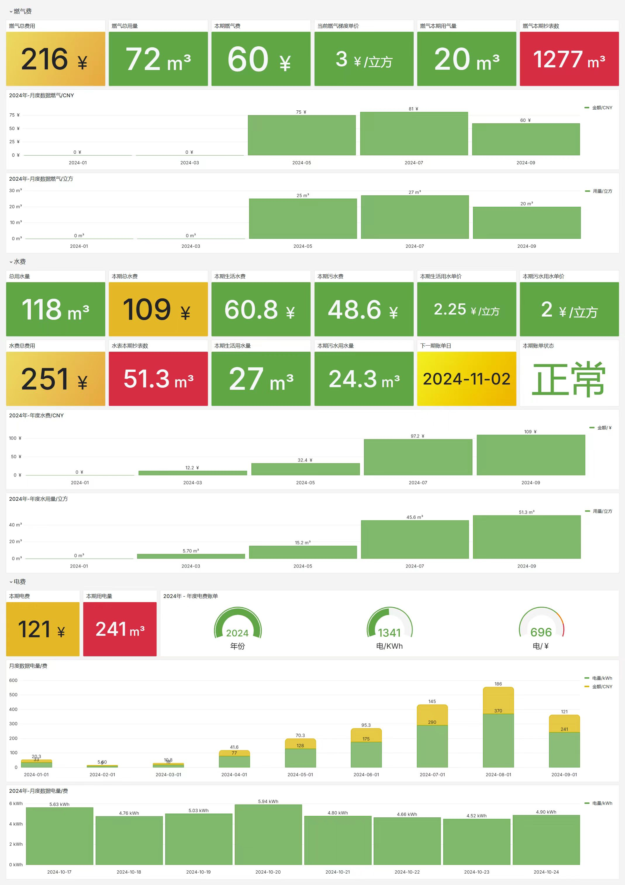
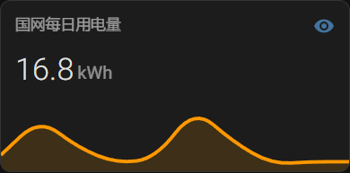
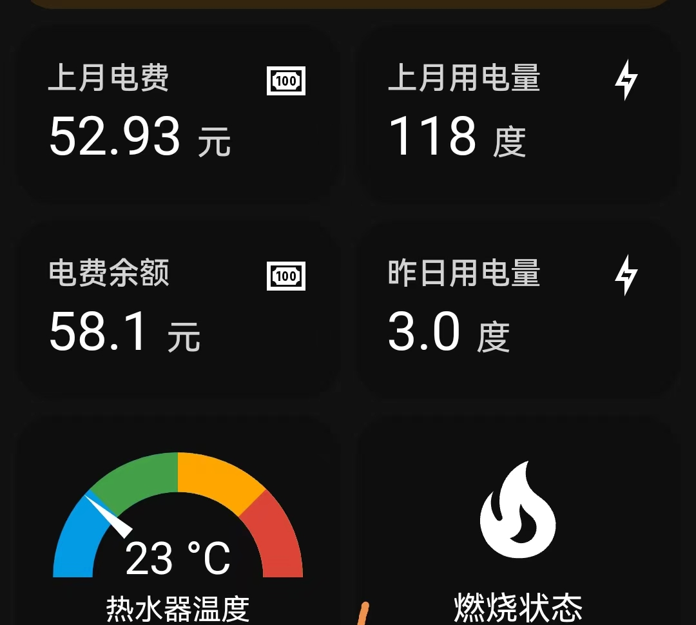
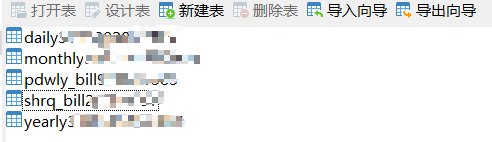
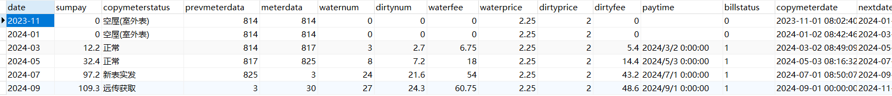
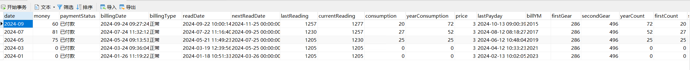
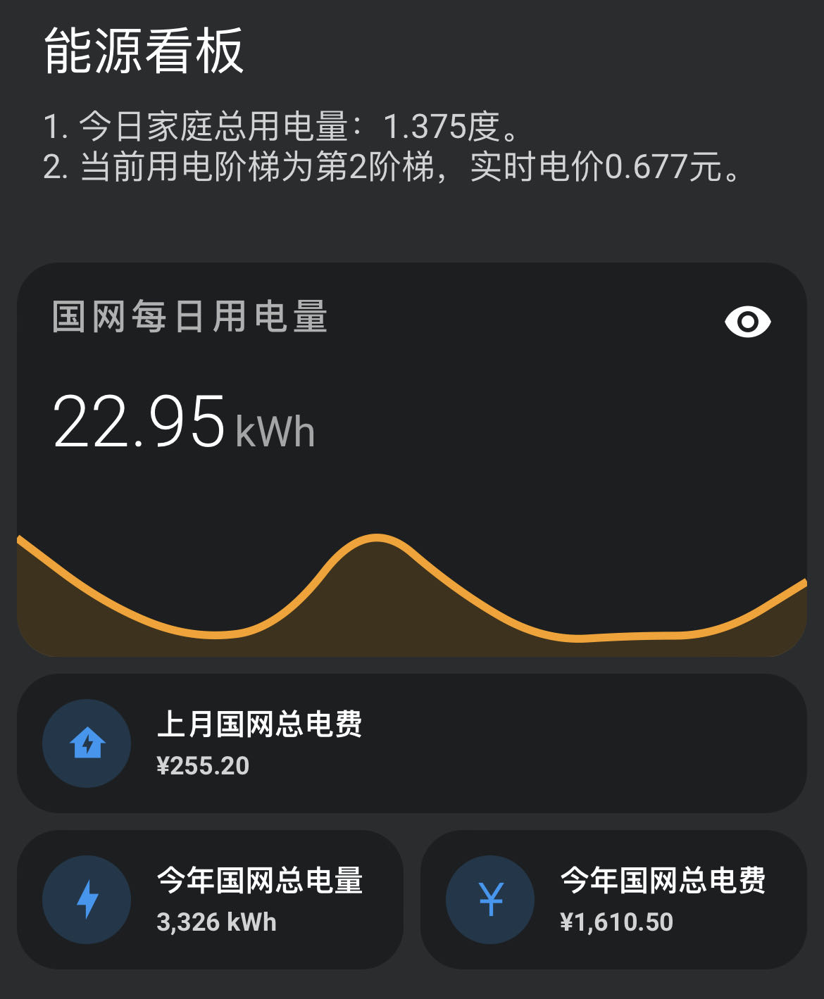
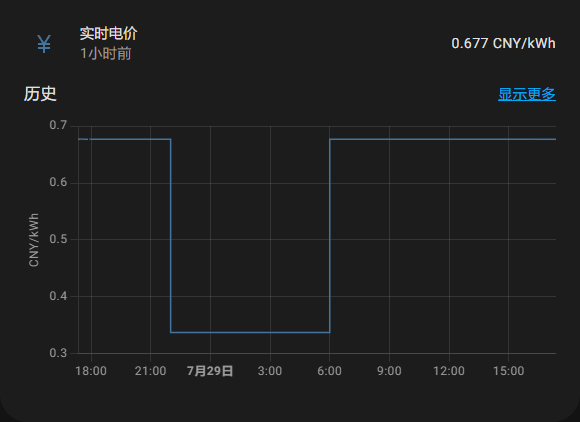
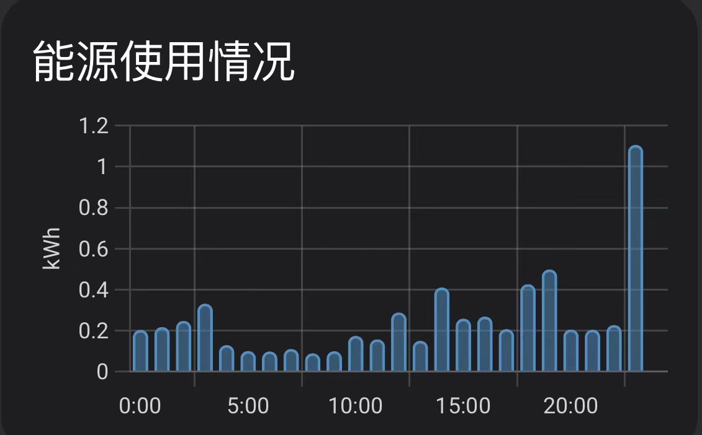

**重要说明：**
仓库从https://github.com/ARC-MX/sgcc_electricity_new.git 克隆进行二开，原先只有国家电网的数据，没有上海燃气，浦东威立雅水费的数据，二开后增加了这些数据。

**注意** 有很多新手都在提交验证码不能识别的相关issue，特在此统一说明：国网每天有登录限制，每天只能登录有限的几次，超过限制验证码识别成功也不会登录成功。
### 支付宝&微信 打赏码

<p align="center">


</p>


### Home Assistant展示效果， 不怎么会玩。
<p align="center">

</p>

### 新增grafana监控看板
<p align="center">

</p>
grafana模板文件 见[水费_电费_燃气-1730082076616.json](assets%2F%CB%AE%B7%D1_%B5%E7%B7%D1_%C8%BC%C6%F8-1730082076616.json)
# ⚡️国家电网电力获取

[](https://github.com/ARC-MX/sgcc_electricity_new/actions/workflows/docker-image.yml)
[](https://hub.docker.com/r/arcw/sgcc_electricity)
[](https://hub.docker.com/r/arcw/sgcc_electricity)

<p align="center">


</p>

本应用可以帮助你将国网的电费、用电量数据接入homeassistant，实现实时追踪家庭用电量情况；并且可以将每日用电量保存到数据库，历史有迹可循。具体提供两类数据：

1. 在homeassistant以实体显示：

   | 实体entity_id                     | 说明                                                                  |
   | --------------------------------- | --------------------------------------------------------------------- |
   | sensor.last_electricity_usage     | 最近一天用电量，单位KWH、度。属性含present_date（查询电量代表的日期） |
   | sensor.electricity_charge_balance | 预付费显示电费余额，反之显示上月应交电费，单位元                      |
   | sensor.yearly_electricity_usage   | 今年总用电量，单位KWH、度。                                           |
   | sensor.yearly_electricity_charge  | 今年总用电费用，单位元                                                |
   | sensor.month_electricity_usage    | 最近一天用电量，单位KWH、度。属性含present_date（查询电量代表的日期） |
   | sensor.month_electricity_charge   | 上月总用电费用，单位元     属性含present_date（查询电量代表的日期）   |


   | 实体entity_id                       | 说明                        |
   |-----------------------------------|---------------------------|
   | sensor.last_pdwly_usage_total     | 本期产生水用量包含生活用水和污水 单位m³     |
   | sensor.last_pdwly_usage_water     | 本期产生水用量生活用水 单位m³          |
   | sensor.last_pdwly_usage_dirty     | 本期产生水用量污水 单位m³            |
   | sensor.last_pdwly_charge_total    | 本期产生费用金额包含生活用水和污水 单位元     |
   | sensor.last_pdwly_charge_water    | 本期产生费用金额生活用水 单位元        |   
   | sensor.last_pdwly_charge_dirty    | 本期产生费用金额污水 单位元            |


   | 实体entity_id                  | 说明             |
   |------------------------------|----------------|
   | sensor.shrq_charge_balance   | 本期燃气费金额 单位元    |
   | sensor.last_shrq_usage       | 本期燃气用量 单位字或者m³ |
   | sensor.yearly_shrq_usage     | 燃气年用量 单位字或者m³  |


2. 可选，近三十天每日用电量数据（SQLite数据库）
   数据库表名为 daily+userid ，在项目路径下有个homeassistant.db  的数据库文件就是；
   可自行查询一些数据：

<p align="left">



</p>

## 一、适用范围

1. 国家电网电费数据。
2. 燃气是上海燃气。
3. 水费是上海浦东威立雅。

## 二、安装

### 1）注册国家电网账户

首先要注册国家电网账户，绑定电表，并且可以手动查询电量

注册网址：[https://www.95598.cn/osgweb/login](https://www.95598.cn/osgweb/login)

### 2）docker镜像部署，速度快

1. 安装docker和homeassistant，[Homeassistant极简安装法](https://github.com/renhaiidea/easy-homeassistant)。
2. 克隆仓库

```bash
git clone https://github.com/xudingjun3131/sgcc_shgas_veolia.git
cd sgcc_electricity_new
```

3. 创建环境变量文件

```bash
cp example.env .env
vim .env
```

参考以下文件编写.env文件

```bash
### 以下项都需要修改
## 国网登录信息
# 修改为自己的登录账号
PHONE_NUMBER="xxx" 
# 修改为自己的登录密码
PASSWORD="xxxx"

## 上海燃气数据
SHRQ_PHONE_NUMBER=177xxxxxxxx
# 上海燃气的密码需要md5加密以下，可以在https://www.jyshare.com/crypto/md5/上面操作，复制密文即可，terminal可以使用 echo -n "password" | md5sum | awk '{print $1}'
SHRQ_PASSWORD=7basca5fb8aascas6easc9b2ed996d67   

## 浦东威立雅账号ID，使用列表形式填写。一个就['xxxxxxxxx']
PDWLY_ID=['xxxxxxxxx','yyyyyyyyy']

## homeassistant配置
# 改为你的localhost为你的homeassistant地址
HASS_URL="http://localhost:8123/" 
# homeassistant的长期令牌
HASS_TOKEN="eyxxxxx"

#### 以下可以保持不动
## selenium运行参数
# 任务开始时间，24小时制，例如"07:00"则为每天早上7点执行，第一次启动程序如果时间晚于早上7点则会立即执行一次，每隔12小时执行一次。
JOB_START_TIME="07:00"

## 其他默认参数
# 浏览器默认等待时间，秒。
DRIVER_IMPLICITY_WAIT_TIME=60
# 登录重试次数
RETRY_TIMES_LIMIT=5
# 登录超时时间，秒
LOGIN_EXPECTED_TIME=60
RETRY_WAIT_TIME_OFFSET_UNIT=10


## 日志级别
# 例如“DUBUG”可以查看出错情况
LOG_LEVEL="INFO"

## 记录的天数, 仅支持填写 7 或 30
# 国网原本可以记录 30 天,现在不开通智能缴费只能查询 7 天造成错误
DATA_RETENTION_DAYS=7

## 余额提醒
# 是否缴费提醒
RECHARGE_NOTIFY=Flase
# 余额
BALANCE=5.0
# pushplus token 如果有多个就用","分隔，","之间不要有空格，单个就不要有","
PUSHPLUS_TOKEN=xxxxxxx,xxxxxxx,xxxxxxx
```

4. 运行

  新的镜像多了ddddocr验证码包，可以自己参考Dockerfile制作一个

  image: xudingjun3131/sgcc_shgas_veolia:v1.0

```bash
docker compose up -d 
```

5. 更新容器及其代码

```bash
docker compose down # 删除容器 
docker compose pull # 更新镜像
git pull --tags origin master:master	#更新代码，代码不在容器中，所以要手动更新
docker compose up # 重新运行
```

6. 运行成功应该显示如下日志：

```bash
2024-06-06 16:00:43  [INFO    ] ---- 程序开始，当前仓库版本为1.x.x，仓库地址为https://github.com/ARC-MX/sgcc_electricity_new.git
2024-06-06 16:00:43  [INFO    ] ---- enable_database_storage为false，不会储存到数据库
2024-06-06 16:00:43  [INFO    ] ---- 当前登录的用户名为: xxxxxx，homeassistant地址为http://192.168.1.xx:8123/,程序将在每天00:00执行
2024-06-06 16:00:43  [INFO    ] ---- 此次为首次运行，等待时间(FIRST_SLEEP_TIME)为10秒，可在.env中设置
2024-06-06 16:00:59  [INFO    ] ---- Webdriver initialized.
2024-06-06 16:01:20  [INFO    ] ---- Click login button.
2024-06-06 16:01:20  [INFO    ] ---- Get electricity canvas image successfully.
2024-06-06 16:01:20  [INFO    ] ---- Image CaptCHA distance is xxx.
2024-06-06 16:01:25  [INFO    ] ---- Login successfully on https://www.95598.cn/osgweb/login
2024-06-06 16:01:33  [INFO    ] ---- 将获取1户数据，user_id: ['xxxxxxx']
2024-06-06 16:01:42  [INFO    ] ---- Get electricity charge balance for xxxxxxx successfully, balance is xxx CNY.
2024-06-06 16:01:51  [INFO    ] ---- Get year power usage for xxxxxxx successfully, usage is xxx kwh
2024-06-06 16:01:51  [INFO    ] ---- Get year power charge for xxxxxxx successfully, yealrly charge is xxx CNY
2024-06-06 16:01:55  [INFO    ] ---- Get month power charge for xxxxxxx successfully, 01 月 usage is xxx KWh, charge is xxx CNY.
2024-06-06 16:01:55  [INFO    ] ---- Get month power charge for xxxxxxx successfully, 02 月 usage is xxx KWh, charge is xxx CNY.
2024-06-06 16:01:55  [INFO    ] ---- Get month power charge for xxxxxxx successfully, 2024-03-01-2024-03-31 usage is xxx KWh, charge is xxx CNY.
2024-06-06 16:01:55  [INFO    ] ---- Get month power charge for xxxxxxx successfully, 2024-04-01-2024-04-30 usage is xxx KWh, charge is xxx CNY.
2024-06-06 16:01:59  [INFO    ] ---- Get daily power consumption for xxxxxxx successfully, , 2024-06-05 usage is xxx kwh.
2024-06-06 16:02:07  [INFO    ] ---- Webdriver quit after fetching data successfully.
2024-06-06 16:02:07  [INFO    ] ---- 浏览器已退出
```

## 四、配置与使用

### 1）**第一次运行需要创建并填写.env文件，按文件说明进行填写。**

### 2）（可选）修改实体

#### 填写homeassistant的配置文件

由于采用REST API方式创建sensor，没有做实体注册，无法在webui里编辑。如果需要，你可以在configuration.yaml下增加如下配置后重启HA，这样你就可在webUI编辑对应的实体了，这样含有_entity后缀的实体就可以进行修改了。

- 如果你有一个户号，参照以下配置：

# Example configuration.yaml entry

# 文件中只能有一个template

```yml
template:
  - trigger:
      - platform: event
        event_type: state_changed
        event_data:
          entity_id: sensor.electricity_charge_balance
    sensor:
      - name: electricity_charge_balance_entity
        unique_id: electricity_charge_balance_entity
        state: "{{ states('sensor.electricity_charge_balance') }}"
        state_class: total
        unit_of_measurement: "CNY"
        device_class: monetary

  - trigger:
      - platform: event
        event_type: state_changed
        event_data:
          entity_id: sensor.last_electricity_usage
    sensor:
      - name: last_electricity_usage_entity
        unique_id: last_electricity_usage_entity
        state: "{{ states('sensor.last_electricity_usage') }}"
        attributes:
          present_date: "{{ state_attr('sensor.last_electricity_usage', 'present_date') }}"
          last_updated: "{{ state_attr('sensor.last_electricity_usage', 'last_updated') }}"
        state_class: total_increasing
        unit_of_measurement: "kWh"
        device_class: energy

  - trigger:
      - platform: event
        event_type: state_changed
        event_data:
          entity_id: sensor.month_electricity_usage
    sensor:
      - name: month_electricity_usage_entity
        unique_id: month_electricity_usage_entity
        state: "{{ states('sensor.month_electricity_usage') }}"
        attributes:
          present_date: "{{ state_attr('sensor.month_electricity_usage', 'present_date') }}"
          last_updated: "{{ state_attr('sensor.month_electricity_usage', 'month_updated') }}"
        state_class: total_increasing
        unit_of_measurement: "kWh"
        device_class: energy

  - trigger:
      - platform: event
        event_type: state_changed
        event_data:
          entity_id: sensor.month_electricity_charge
    sensor:
      - name: month_electricity_charge_entity
        unique_id: month_electricity_charge_entity
        state: "{{ states('sensor.month_electricity_charge') }}"
        attributes:
          present_date: "{{ state_attr('sensor.month_electricity_charge', 'present_date') }}"
          last_updated: "{{ state_attr('sensor.month_electricity_charge', 'month_updated') }}"
        state_class: total_increasing
        unit_of_measurement: "CNY"
        device_class: monetary

  - trigger:
      - platform: event
        event_type: state_changed
        event_data:
          entity_id: sensor.yearly_electricity_usage
    sensor:
      - name: yearly_electricity_usage_entity
        unique_id: yearly_electricity_usage_entity
        state: "{{ states('sensor.yearly_electricity_usage') }}"
        state_class: total_increasing
        unit_of_measurement: "kWh"
        device_class: energy

  - trigger:
      - platform: event
        event_type: state_changed
        event_data:
          entity_id: sensor.yearly_electricity_charge
    sensor:
      - name: yearly_electricity_charge_entity
        unique_id: yearly_electricity_charge_entity
        state: "{{ states('sensor.yearly_electricity_charge') }}"
        state_class: total_increasing
        unit_of_measurement: "CNY"
        device_class: monetary
```

如果你有多个户号，每个户号参照[configuration.yaml](template/configuration.yaml)配置。

- **注：如果你有一个户号，在HA里就是以上实体名；****如果你有多个户号，实体名称还要加 “_户号”后缀，举例:sensor.last_electricity_usage_1234567890**

❗️`<u>`**进行自定义操作之后，请使用带entity的实体。比如使用sensor.last_electricity_usage_entity_1234567890而不是sensor.last_electricity_usage_1234567890。**`</u>`

### 3）（可选）ha内数据展示

结合mini-graph-card](https://github.com/kalkih/mini-graph-card) 和[mushroom](https://github.com/piitaya/lovelace-mushroom)实现效果：



```yaml
type: custom:mini-graph-card
entities:
  - entity: sensor.last_electricity_usage_entity
    name: 国网每日用电量
    aggregate_func: first
    show_state: true
    show_points: true
group_by: date
hour24: true
hours_to_show: 240
```

### 4）（可选）配合用电阶梯，实现实时电价。



#### 具体操作：

修改homeassistant.yml文件然后重启或重载配置文件，注意当前阶梯中的sensor.yearly_electricity_usage_entity要根据你的实际情况修改：

```yaml
# 文件中只能有一个sensor
sensor:
  # 实时电价
  - platform: template #平台名称
    sensors: #传感器列表
      real_time_electricity_price: #实体名称：只能用小写，下划线
        unique_id: "real_time_electricity_price" #UID（必须）
        friendly_name:  '实时电价' #在前端显示的传感器昵称（可选)
        unit_of_measurement: "CNY/kWh" #传感器数值的单位（可选）
        icon_template: mdi:currency-jpy #默认图标
        value_template: > #定义一个获取传感器状态的模板（必须）下面的6和22是指6点和22点，"1""2""3"是指阶梯123，6个价格分别是3个阶梯的峰谷价格
          {% if now().strftime("%H")| int >= 6 and now().strftime("%H")|int < 22 and states("sensor.current_ladder")=="1" %}
            0.617
          {%elif now().strftime("%H")| int >= 6 and now().strftime("%H")|int < 22 and states("sensor.current_ladder")=="2" %}
            0.677
          {%elif now().strftime("%H")| int >= 6 and now().strftime("%H")|int < 22 and states("sensor.current_ladder")=="3" %}
            0.977
          
            0.307
          
            0.337
          
            0.487
          

# 当前阶梯
  - platform: template
    sensors:
      current_ladder:
        unique_id: "current_ladder"
        friendly_name:  '当前阶梯'
        unit_of_measurement: "级"
        icon_template: mdi:elevation-rise
        value_template: > #这里是上海的三个阶梯数值，第2阶梯3120，第三阶梯4800
          
          1
          
          2
          
          3
          
```

可以在能源面板进行配置，对可以统计电量的设备实现分阶梯计算用电量。

> tip：打开ha>仪表盘>能源>添加用电数据>实时电价实体-选择real_time_electricity_price。



### 5）电量通知

  更新电费余额不足提醒，在.env里设置提醒余额。目前我是用[pushplus](https://www.pushplus.plus/)的方案，注册pushplus然后，获取token，通知给谁就让谁注册并将token填到.env中

## token获取方法参考[https://cloud.tencent.com/developer/article/2139538](https://cloud.tencent.com/developer/article/2139538)

## 写在最后

> 当前作者：[https://github.com/xudingjun3131/sgcc_shgas_veolia](https://github.com/xudingjun3131/sgcc_shgas_veolia)
> 
> 原作者：[https://github.com/ARC-MX/sgcc_electricity_new](https://github.com/ARC-MX/sgcc_electricity_new)
>
> 更早原作者：[https://github.com/louisslee/sgcc_electricity](https://github.com/louisslee/sgcc_electricity)，原始[README_origin.md](归档/README_origin.md)。
